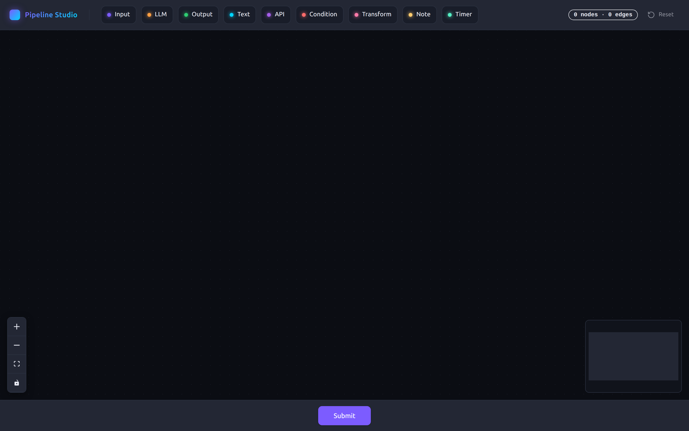
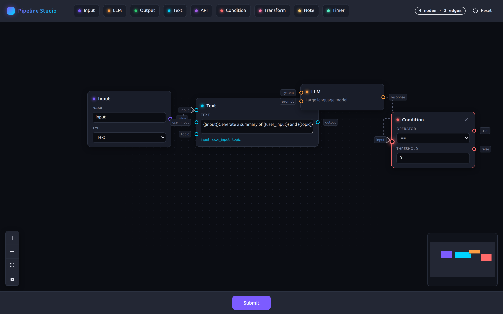
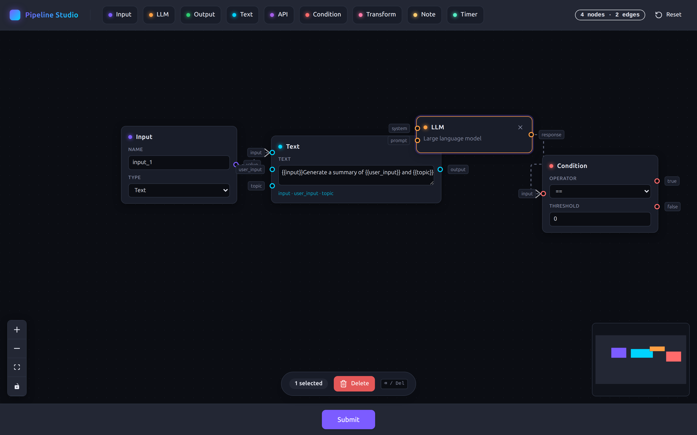
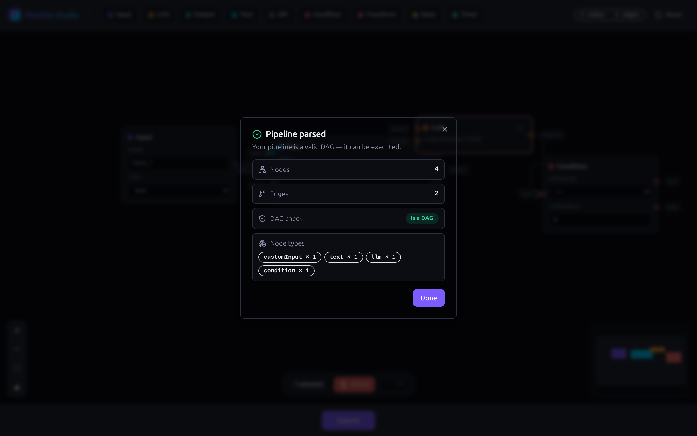
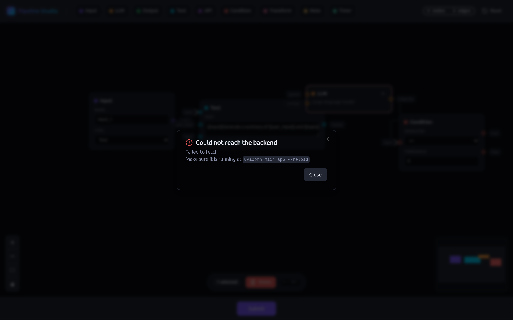

# VectorShift Pipeline Builder

A visual **pipeline builder** — drag node types from a toolbar onto a ReactFlow canvas, connect them with edges, then submit the pipeline to a FastAPI backend that reports `num_nodes`, `num_edges`, and whether the graph is a DAG.

Built as a frontend technical assessment for VectorShift: a config-driven node abstraction, a shadcn-styled dark UI, a smart text node, and full backend DAG validation.

## Features

- **Config-driven node system** — every node type is *declared* in a single registry (`label`, accent color, fields, handles), not copy-pasted. 9 node types: Input, LLM, Output, Text, API Call, Condition, Transform, Note, Timer.
- **Text node** — auto-grows with content and turns `{{variable}}` placeholders into dynamic input handles (one left-handle per unique variable, added/removed as you type).
- **shadcn/Tailwind UI** — dark theme with shadcn-style components (button, badge, dialog), live toolbar stats, per-node accent colors.
- **Result modal** — submitting opens a centered dialog with node/edge counts, a DAG check badge, and a node-type breakdown (no more browser `alert()`).
- **Delete UX** — floating selection bar over the canvas (N selected + Delete + ⌫ hint) and a per-node **×** button on hover. Keyboard `Backspace`/`Delete` also works.
- **Connection guards** — self-loops and duplicate edges are blocked with a toast notification.
- **Auto-save** — the pipeline persists to `localStorage` and survives page reloads; a Reset button clears the canvas.
- **Backend DAG check** — Kahn's algorithm (topological sort) returns `is_dag`, plus `topological_order` and `node_type_counts`. Malformed payloads get a clean `400`.

## Screenshots

| Toolbar & node palette | Pipeline canvas |
|:---:|:---:|
|  |  |

| Selection & delete UX | Result modal | Backend error modal |
|:---:|:---:|:---:|
|  |  |  |

## Tech Stack

- **Frontend:** React 18, Create React App 5, [ReactFlow](https://reactflow.dev/) 11, Zustand, Tailwind CSS 3 + shadcn-style components, Radix UI, lucide-react
- **Backend:** Python, FastAPI, Uvicorn

## Getting Started

### 1. Backend (port 8000)

```bash
cd backend
pip install fastapi uvicorn
uvicorn main:app --reload
```

### 2. Frontend (port 3000)

```bash
cd frontend
npm i
npm start
```

Open [http://localhost:3000](http://localhost:3000). Drag nodes onto the canvas, connect them, then hit **Submit** — the result modal shows `num_nodes`, `num_edges`, and whether the graph is a DAG.

## How the graph contract works

`POST /pipelines/parse` (form-encoded `pipeline` JSON) responds:

```json
{
  "num_nodes": 3,
  "num_edges": 2,
  "is_dag": true,
  "topological_order": ["input-1", "text-1", "llm-1"],
  "node_type_counts": { "customInput": 1, "text": 1, "llm": 1 }
}
```

- `topological_order` is only populated when `is_dag` is `true`.
- A DAG (directed acyclic graph) has no cycles — a pipeline with a loop is reported as `is_dag: false`.

## Project Structure

```
frontend/src/
  nodes/registry.js          single source of truth for node types + createNode factory
  nodes/BaseNode.js          config-driven node shell (header, fields, handles, x button)
  nodes/textNode.js          Text node body (auto-grow) + {{variable}} handle parsing
  store.js                   Zustand store: nodes, edges, persistence, delete/reset actions
  ui.js                      ReactFlow canvas, onDrop creation, connection guards
  toolbar.js                 node palette + live stats + reset
  submit.js                  POST to /pipelines/parse, opens result modal
  ResultModal.jsx            shadcn Dialog with parse result / error state
  SelectionBar.jsx           floating over-canvas selection actions
  components/ui/             shadcn-style button / badge / dialog
backend/
  main.py                    FastAPI — /pipelines/parse (Kahn's DAG check), CORS
```

Adding a new node type is two lines: one config in `nodes/registry.js` + one `<DraggableNode />` in `toolbar.js`.

## Agent documentation

This repo is set up for multi-agent work — see `AGENTS.md` (agent contract & graph-engineering rules), `CONTEXT.md` (append-only project journal), and `PROJECT_CONTEXT.md` (assessment briefing).
